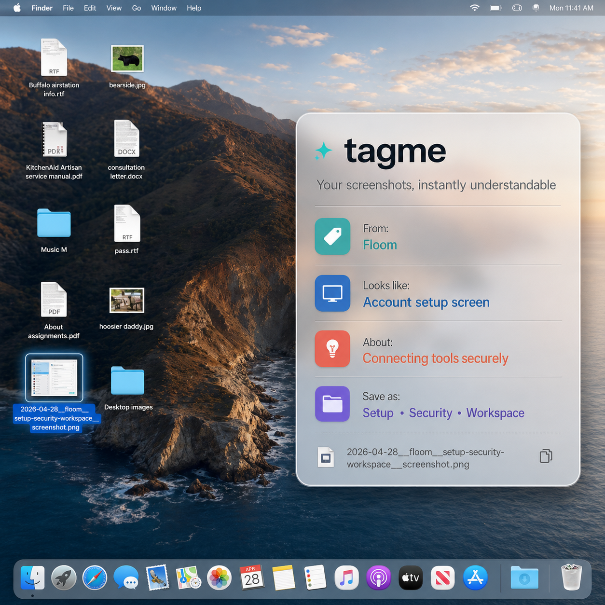

# Tagme — Auto-Label & Organize Your Files with Local AI

Your Desktop and Downloads folder are a mess. Screenshots pile up with names like `IMG_4121.heic`. Documents sit as `document.pdf`. Finding that one receipt, screenshot, or invoice later is nearly impossible.

**Tagme** is a local macOS daemon that automatically labels your files using local AI. It reads text in images and documents, understands what's inside, and renames files with searchable tags — so Finder, terminal search, and any AI agent can find them in seconds.

```
IMG_4121.heic
→ 2026-06-05__finance-transactions-euro-credit__img-4121.png

document.pdf
→ 2026-06-05__hiring-contract-onboarding__document.pdf
```

**No cloud. No API keys. No subscriptions.** Everything runs locally on your Mac via Ollama.



---

## Examples

### Screenshots (v0.1)

| Before | After |
|---|---|
| `Screenshot 2026-06-05 at 11.54.13 AM.png` | `2026-06-05__pipeline-summary-sales-hiring__screenshot.png` |
| `IMG_4121.heic` | `2026-06-05__finance-transactions-euro-credit__img-4121.png` |


Tagme reads the text on screen, understands the context, and writes tags into the filename. Search `sales`, `hiring`, or `finance` and find it instantly.

### Documents (v0.2)

| Before | After (filename unchanged) |
|---|---|
| `document.pdf` | `document.pdf` + searchable metadata |
| `Untitled.docx` | `Untitled.docx` + searchable metadata |

Tags are written to xattrs and PDF Keywords/Subject (Spotlight). Filename stays the same unless you set `doc_rename: generic_only`.


---

## What's Shipped

| Version | Scope | Status |
|---|---|---|
| **v0.1** | Screenshots & generic camera images (OCR + vision, rename) | Shipped |
| **v0.2** | Docs with junk names only: enrich metadata, keep filename | Shipped |

Tagme watches for **new files with useless names**. Files you already named well are never touched.

### Safety rules (docs)

- **Never renames docs by default** (`doc_rename: never`)
- Only touches obvious junk: `document.pdf`, `Untitled.docx`, `scan.pdf`
- Skips meaningful names like `Q3-Report-Acme.pdf`
- Skips random strings like `a8f3k2j1.pdf`
- Skips files already enriched (won't re-tag)
- Skips if it can't extract text or get good tags (no garbage labels)
- Never deletes files
- PDF Keywords only written if empty (won't overwrite yours)

Screenshots are different: those names are useless, so rename is the feature.

---

## What Tagme Does

| Problem | Before Tagme | After Tagme |
|---|---|---|
| Screenshots | `Screenshot 2026-06-05...png` | `2026-06-05__berlin-office-remote__screenshot.png` |
| Receipts | `IMG_4268.heic` | `2026-06-05__finance-transactions-euro-credit__img-4268.png` |
| Documents | `document.pdf` | `2026-06-05__hiring-contract-onboarding__document.pdf` |
| Finding files | Scroll forever | `find ~/Downloads -name '*finance*'` |

---

## How It Works

### Screenshots (v0.1)
1. **Scan** — A LaunchAgent runs every 2 minutes, watching your Desktop, Downloads, and Documents
2. **OCR** — Tesseract extracts all readable text from images
3. **Vision** — A local vision model (Llava via Ollama) cross-references pixels + OCR text
4. **Tag** — 4 content tags generated from image content
5. **Write** — Tags go into **filename**, **EXIF** (`ImageDescription`), **xattrs**, and SQLite
6. **Search** — Spotlight (`mdfind`), Finder, terminal, or any AI agent

### Documents (v0.2)
1. **Detect** — Only junk doc names like `document.pdf`, `Untitled.docx`, `scan.pdf`
2. **Extract** — Text from `.txt`/`.md` directly; `.pdf` via `pdftotext` or `textutil`; `.docx` via built-in parser
3. **Tag** — Local text model generates 4 content tags (no vision). Skips if tags aren't good enough.
4. **Enrich** — Tags go into **xattrs** and **PDF Keywords** (if empty). Filename unchanged by default.
5. **Search** — Spotlight picks up PDF keywords; terminal/agents can read xattrs

---

## Install (macOS)

### 1. Install dependencies

```bash
brew install tesseract imagemagick exiftool ollama poppler
```

`poppler` provides `pdftotext` for PDF extraction. macOS `textutil` is used as fallback.

### 2. Pull the vision model

```bash
ollama pull llava:7b
```

**Alternatives:** `llava-phi3` (2.9GB, faster) or `llava:13b` (8GB, sharper but slower).

### 3. Download Tagme

```bash
curl -o ~/bin/tagme https://raw.githubusercontent.com/floomhq/tagme/main/bin/auto_file_labeler.py
chmod +x ~/bin/tagme
```

### 4. Configure

```bash
mkdir -p ~/.config/file-labeler
curl -o ~/.config/file-labeler/config.json https://raw.githubusercontent.com/floomhq/tagme/main/config/config.example.json
# Edit paths and settings to taste
```

### 5. Install the LaunchAgent

```bash
curl -o ~/Library/LaunchAgents/com.federico.filelabeler.plist https://raw.githubusercontent.com/floomhq/tagme/main/launchd/com.federico.filelabeler.plist
launchctl load ~/Library/LaunchAgents/com.federico.filelabeler.plist
```

---

## Search Your Files

### Finder / Terminal (filename tags — works for all file types)
```bash
find ~/Desktop -name '*finance*'
find ~/Downloads -name '*rocketlist*'
```

### Spotlight (images only — uses EXIF `ImageDescription`)
```bash
mdfind "kMDItemDescription == '*finance*'"
```

### xattrs (programmatic access)
```bash
xattr -p user.floomlens.labels ~/Desktop/2026-06-05__finance*.png
```

---

## Config Options

```json
{
  "watch_dirs": ["/Users/you/Desktop", "/Users/you/Downloads"],
  "ignore_prefixes": [".", "_Desktop_Cleanup_"],
  "rename": true,
  "filename_format": "{date}__{labels}__{orig}",
  "max_labels": 4,
  "model": "llava:7b",
  "endpoint": "http://127.0.0.1:11434/api/generate",
  "timeout": 60,
  "recursive": false,
  "process_docs": true,
  "doc_rename": "never",
  "doc_finder_tags": false,
  "doc_pdf_keywords": true
}
```

| Key | Description |
|---|---|
| `watch_dirs` | Directories to scan for new files |
| `rename` | Rename files with generated tags? |
| `filename_format` | Pattern: `{date}__{labels}__{orig}` + extension |
| `max_labels` | 1–10 tags per file (default 4) |
| `model` | Ollama model name (vision for images, text for docs) |
| `timeout` | Model inference timeout in seconds |
| `recursive` | Scan subdirectories? |
| `process_docs` | Enable v0.2 document enrichment (`.pdf`, `.docx`, `.txt`, `.md`) |
| `doc_rename` | `never` (default) or `generic_only` |
| `doc_finder_tags` | Write visible Finder tags (off by default) |
| `doc_pdf_keywords` | Write PDF Keywords/Subject when empty (on by default) |

---

## Run Manually

```bash
~/bin/tagme
```

Run built-in tests:
```bash
TEST=1 ~/bin/tagme
```

---

## FAQ

**Q: Does it work on Apple Silicon?**  
A: Yes. Tested on M2 Macs. Ollama uses the GPU for inference.

**Q: Will it re-tag files already processed?**  
A: No. It fingerprints files by content (size + mtime + inode). Renamed files are not reprocessed.

**Q: Will it rename files I already named well?**  
A: No. Docs keep their filename by default. Only obvious junk names get enriched. Screenshots with useless names get renamed.

**Q: Will it touch my `Q3-Report.pdf`?**  
A: No. Meaningful filenames are skipped entirely.

**Q: Can it search my old buried documents?**  
A: Not yet. Tagme labels new files on ingest. Retroactive backfill is planned.

**Q: What about privacy?**  
A: Everything is local. No cloud, no API keys, no data leaves your Mac.

---

## License

MIT
